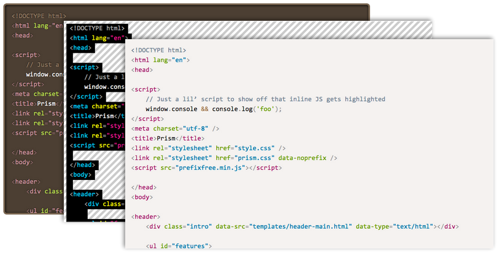

For the past three weeks, on and off, I’ve been working on releasing [Dabblet](http://dabblet.com)’s syntax highlighter as standalone, since many people had requested it. Zachary Forrest  [suggested the name "Prism"](https://twitter.com/zdfs/statuses/217834980871639041) and I liked it so much I decided to go with it, even though there is [an abandoned Mozilla project with the same name](https://wiki.mozilla.org/Prism). I ended up refactoring and extending it so much that I will need to backport it to Dabblet one of these days! This doesn’t mean I bloated it, the core is still a tiny 1.5KB minified & gzipped. It just means it’s more awesome. :)

## Seriously? The world needs another syntax highlighter?

In certain ways, Prism is better than any other syntax highlighter I’ve seen:

- It’s tiny. The core is only 1.5KB minified & gzipped, which can go up to 2KB with the currently available language definitions (CSS, Markup and JS). But many other highlighters are also small, so read on.
- It's **incredibly extensible**. Not only it's easy to add new languages (that's a given with every syntax highlighter these days), but also to **extend existing ones**. Most importantly, it supports **plugins**, through **hooks strategically placed in its source**. There are [a few plugins already available](http://prismjs.com/plugins/), and it's [really easy to write your own](http://prismjs.com/extending.html#writing-plugins). I haven't seen any other highlighter that supports plugins.
- It **encourages good author practices**. Other highlighters encourage or even force you to use elements that are semantically wrong, like `<pre>` (on its own) or `<script>`. Prism forces you to use the only semantically correct element for marking up code: `<code>`. On its own for inline code, or inside a `<pre>` for blocks of code. In addition, the code language is declared through [the way recommended in the HTML5 draft](http://www.w3.org/TR/html5/the-code-element.html#the-code-element): through a language-xxxx class.
- One of its best features: **The language definition is inherited**. This means that if multiple code snippets have the same language, you can just define it once, in one of their common ancestors. Obviously, if you define a language on the `<body>` element, you’ve essentially declared a default language for the entire document.
- **It looks good**. All three of its existing themes. Most people wanted me to release Dabblet's highlighter because they found other highlighters (including their themes) quite ugly.
- It supports **parallelism through Web Workers**, for better performance in certain cases.
- It **doesn’t force you to use any Prism-specific markup**, not even a Prism-specific class name, only standard markup you should be using anyway. So, you can just try it for a while, remove it if you don’t like it and leave no traces behind.

However, there are some limitations too:

- Pre-existing HTML in the code block will be stripped off. However, there are plugins for [links](http://prismjs.com/plugins/autolinker/) and [highlighting certain lines](http://prismjs.com/plugins/line-highlight).
- I decided not to support IE8. Prism won't break on IE8, it just won't work. I don’t think many people using IE8 and below are able to read code, so I don't see the point.

Enjoy: [prismjs.com](http://prismjs.com)

If you like this project, don’t forget to [follow @prismjs on Twitter](https://twitter.com/prismjs)!

I'll soon update this blog to use Prism in the code examples as well.
