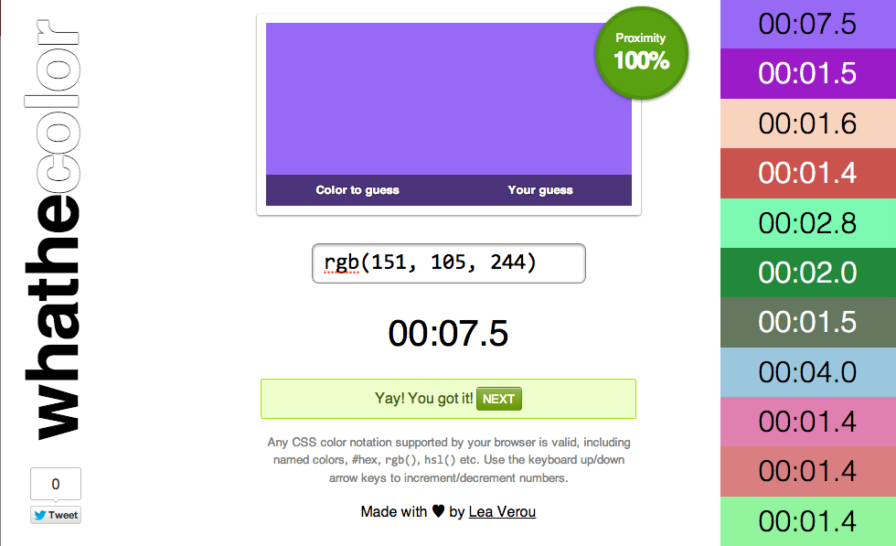

I’ve been interested in digital color for a long time, and this year I decided to risk giving a technical talk about color some of the conferences I’m speaking at. “Why is that risky?” you might ask. Well, it might end up being really interesting, or it may end up alienating both designers because it’s too technical and developers because it’s about a “designery” topic.

In preparation for this talk, I decided to make a simple game to see how well I and other web developers understand color, and especially CSS notations of color. Meet [Whathecolor](http://leaverou.github.io/whathecolor)!

The idea is simple: You are presented with a color and you try to type in a CSS color that matches it. It could be anything, from hsl() or rgb() to even named colors (although that would be stupid). It would be interesting to see what averages people get by trying hsl() vs rgb() and whether the former is as easier for web developers as we think. Feel free to post your results here or on twitter! Perhaps in the future, something like this could be used by the CSS WG to test the usability of color notations we’re thinking of adding to CSS instead of speculating about it.

Disclaimer: This is a quick hack. Please don’t complain that it doesn't look great on your phone and stuff like that.

Also, yes, if you want to cheat, it’s super easy, but I have no idea why somebody would cheat on something like this.

[Play](http://leaverou.github.io/whathecolor)

### Color proximity

A challenging part in developing this was calculating the proximity of two colors to show the user how close they are getting. My first thought was to use the Euclidean distance of the two colors in the RGB cube and divide it by the maximum distance the color could have from any other RGB color. However, this proved out to be inaccurate in many cases, probably due to the lack of perceptual uniformity in RGB. As an example, try `#f0f` and `#ff80ff`. Although they are quite similar visually, the reported proximity was around 66% (1 - 128/382).

So I researched  existing algorithms to get the proximity of two colors. Like most things color-related, it looks like [Color Difference](http://en.wikipedia.org/wiki/Color_difference) is not quite as simple as I thought, and is considered a topic of interest in Color Science. However, converting to L\*a\*b\* and using the CIE94 and CIEDE2000 formulas seemed a bit of an overkill for this and I wasn't terribly impressed with the CIE76 formula after trying the results out [online](http://colormine.org/delta-e-calculator/) for some sample pairs (e.g. it gives ~60% for the aforementioned pair, which is even lower than what I got with my naïve RGB method!).

So I experimented a bit and ended up using an average of my original idea and a sum of the HSL differences (divided by the max differences), which seems to work relatively ok.  There are still cases where it’s off, but ho hum. After all, the proximity is mainly useful when you get close enough to the color (>90%), as until then you tend to play it by eye. Any improvements on the algorithm used are welcome. Or if enough people think it’s not working very well, I’ll bite the bullet and end up using DeltaE.

### Other notes

- You do not need a proximity of 100% to win, since rounding errors might prevent you from matching the exact color if you're using HSL. Also, because matching the exact same color isn't really important, as long as you get close enough that any difference is imperceptible.
- I wrote a Color “class” for this, which you can find in [color.js](http://leaverou.github.io/whathecolor/color.js). Like most of my open source stuff, it’s MIT licensed. Maybe it could be useful in some other color-related project, who knows.
- My original idea was to have “levels”, where the color would get increasingly more difficult to get. For example, in the first level, you'd only have to guess simple colors whose RGB coordinates were either 0, 128 or 255. So, my Color.random() method accepts an entropy parameter, for that level. However, when I tested the game with truly random colors (any integer from 0 to 255), it turned out it wasn't really that hard (it took me about a minute to guess each color), so I ditched the idea of levels early on. The code is still there though.
- An idea about making it harder in the future would be to introduce semi-transparent (RGBA/HSLA) colors. That would be fun :evil\_grin:

PS: The times in this screenshot aren’t real, I wanted to take one quickly, so I used the dev tools.
