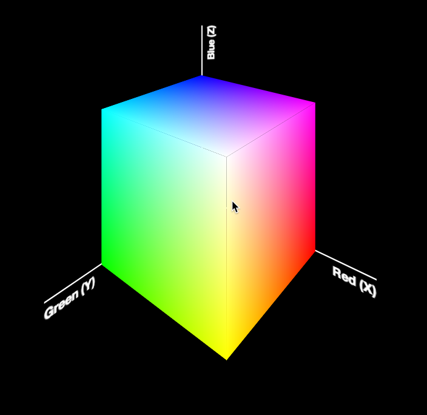
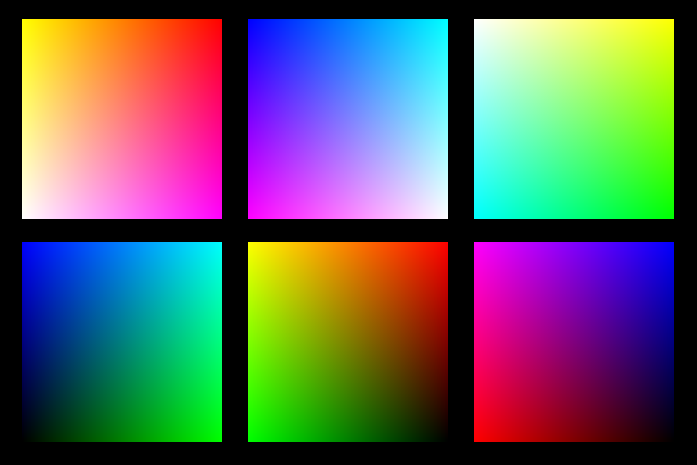

[](http://leaverou.github.io/chroma-zone/rgb-cube.html)Today, I was giving the opening keynote at [Codemania](http://codemania.co.nz/) in Auckland, New Zealand. It was a talk about color from a math/dev perspective. It went quite well, despite my complete lack of sleep. I mean that quite literally: I hadn’t slept all night. No, it wasn’t the jetlag or the nervousness that kept me up. It was my late minute decision to replace the [static, low-res image of an RGB cube](http://leaverou.github.io/chroma-zone/img/rgb-cube.jpg) I was using until then with a **[3D cube generated with CSS and animated with CSS animations](http://leaverou.github.io/chroma-zone/rgb-cube.html)**. Next thing I knew, it was light outside and I had to start getting ready. However, I don’t regret literally losing sleep to make a slide that is only shown for 20 seconds at most. Not only it was super fun to develop, but also yielded a few things that I thought were interesting enough to blog about.

**The most challenging part wasn't actually the 3D cube.** This has been done tons of times before, it was probably the most common demo for CSS 3D transforms a couple of years ago. The only part of this that could be of interest is that mine only used 2 elements for the cube. This is a dabblet of the cube, without any RGB gradients on it:

<iframe src="http://dabblet.com/gist/9594360" height="800" width="100%"></iframe>

**The challenging part was creating the gradients for the 6 sides.** These are not plain gradients, as you can see below:

[](images/gradients.png)These are basically two linear gradients from left to right, with the topmost one being masked with a gradient from top to bottom. You can use [CSS Masking to achieve this (for Chrome/Safari)](http://dabblet.com/gist/9201622) and SVG Masks for Firefox, but this masks the whole element, which would hide the pseudo-elements needed for the sides. What I needed was masks applied to backgrounds only, not the whole element.

It seemed obvious that the best idea would be to use SVG background images. For example, here is [the SVG background needed for the top left one](http://dabblet.com/gist/9964928):

```markup
<svg xmlns="http://www.w3.org/2000/svg" width="200px" height="200px">

<linearGradient id="yellow-white" x1="0" x2="0" y1="0" y2="1">
	<stop stop-color="yellow" />
	<stop offset="1" stop-color="white" />
</linearGradient>
<linearGradient id="magenta-red" x1="0" x2="0" y1="0" y2="1">
	<stop stop-color="red" />
	<stop offset="1" stop-color="magenta" />
</linearGradient>
<linearGradient id="gradient" x1="0" x2="1" y1="0" y2="0">
	<stop stop-color="white" />
	<stop offset="1" stop-color="black" />
</linearGradient>
<mask id="gradient-mask">
	<rect width="100%" height="100%" fill="url(#gradient)"/>
</mask>

<rect width="100%" height="100%" fill="url(#yellow-white)"/>
<rect width="100%" height="100%" fill="url(#magenta-red)" mask="url(#gradient-mask)"/>

</svg>
```

However, I didn't want to have 6 separate SVG files, especially with this kind of repetition (cross-linking to reuse gradients and masks across different files is still fairly buggy in certain browsers). I wanted to be able to edit this straight from my CSS. And then it hit me: I was using SASS already. I could code SASS functions that generate SVG data URIs!

Here’s the set of SVG generating SASS functions I ended up writing:

```scss
@function inline-svg($content, $width: $side, $height: $side) {
	@return url('data:image/svg+xml,#{$content}');
}

@function svg-rect($fill, $width: '100%', $height: $width, $x: '0', $y: '0') {
	@return unquote('');
}

@function svg-gradient($id, $color1, $color2, $x1: 0, $x2: 0, $y1: 0, $y2: 1) {
	@return unquote('

	');
}

@function svg-mask($id, $content) {
	@return unquote('#{$content}');
}
```

And then I was able to generate each RGB plane with another function that made use of them:

```scss
@function rgb-plane($c1, $c2, $c3, $c4) {
	@return inline-svg(
		svg-gradient('top', $c1, $c2) +
		svg-gradient('bottom', $c3, $c4) +
		svg-gradient('gradient', white, black, 0, 1, 0, 0) +
		svg-mask('gradient-mask', svg-rect('url(%23gradient)')) +
		svg-rect('url(%23bottom)') +
		svg-rect('url(%23top)" mask="url(%23gradient-mask)')
	);
}

/* ... */

.cube {
	background: rgb-plane(blue, black, aqua, lime);

	&::before {
		background: rgb-plane(blue, fuchsia, aqua, white);
	}

	&::after {
		background: rgb-plane(fuchsia, red, blue, black);
	}
}

.cube .sides {
	background: rgb-plane(yellow, lime, red, black);

	&::before {
		background: rgb-plane(yellow, white, red, fuchsia);
	}

	&::after {
		background: rgb-plane(white, aqua, yellow, lime);
	}
}
```

However, the same functions can be used for all sorts of SVG backgrounds and it’s very easy to add a new one. E.g. to make polygons:

```scss
@function svg-polygon($fill, $points) {
	@return unquote('');
}

@function svg-circle($fill, $r: '50%', $cx: '50%', $cy: '50%') {
	@return unquote('');
}
```

You can see [the whole SCSS file here](http://leaverou.github.io/chroma-zone/rgb-cube.scss) and [its CSS output here](http://leaverou.github.io/chroma-zone/rgb-cube.css).

**Warning:** Keep in mind that IE9 and some older versions of other browsers have issues with unencoded SVG data URIs. Also, you still need to escape hashes (`%23` instead of `#`), otherwise Firefox fails.
