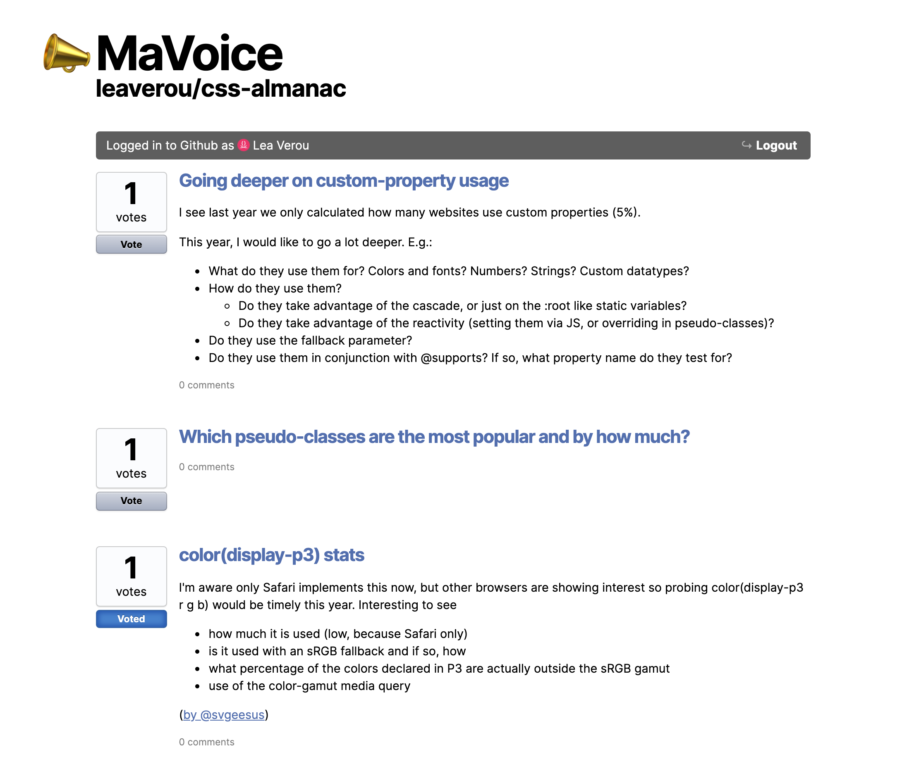

First off, some news: [I agreed to be this year's CSS content lead for the Web Almanac](https://github.com/HTTPArchive/almanac.httparchive.org/issues/898)! One of the first things to do is to flesh out what statistics we should study to answer the question _“What is the state of CSS in 2020?”_. You can see [last year's chapter](https://almanac.httparchive.org/en/2019/css) to get an idea of what kind of statistics could help answer that question.

Of course, my first thought was _“We should involve the community! People might have great ideas of statistics we could study!”_. But what should we use to vote on ideas and make them rise to the top?

I wanted to use [a repo](https://github.com/LeaVerou/css-almanac) to manage all this, since I like all the conveniences for managing issues. However, there is not much on Github for voting. You can add 👍 reactions, but not sort by them, and voting itself is tedious: you need to open the comment, click on the reaction, then go back to the list of issues, rinse and repeat. Ideally, I wanted something like UserVoice™️, which lets you vote with one click, and sorts proposals by votes.

And then it dawned on me: I'll just build a [Mavo](https://mavo.io) app on top of the repo issues, that displays them as proposals to be voted on and sorts by 👍 reactions, UserVoice™️-style but without the UserVoice™️ price tag. 😎 In fact, I had started such a Mavo app a couple years ago, and never finished or released it. So, I just dug it up and resurrected it from its ashes! It’s — quite fittingly I think — called _MaVoice_.

**You can set it to any repo via the `repo` URL parameter, and any label via the `labels` URL param** (defaults to `enhancement`) **to create a customized URL for any repo you want in seconds!** For example, here's the URL for the css-almanac repo, which only displays issues with the label "proposed stat": [https://projects.verou.me/mavoice/?repo=leaverou/css-almanac&labels=proposed%20stat](https://projects.verou.me/mavoice/?repo=leaverou/css-almanac&labels=proposed%20stat)

While this did need some custom JS, unlike other Mavo apps which need none, I'm still pretty happy I could spin up this kind of app with [< 100 lines of JS](https://github.com/LeaVerou/mavoice/blob/master/mavoice.js) :)

Yes, it's still rough around the edges, and I'm sure you can find many things that could be improved, but it does the job for now, and PRs are always welcome 🤷🏽‍♀️

**The main caveat if you decide to use this for your own repo**: Because (to my knowledge) Github API still does not provide a way to sort issues by 👍 reactions, or even reactions in general (in either the v3 REST API, or the GraphQL API), issues are instead requested sorted by comment count, and are [sorted by 👍 reactions client-side, right before render](https://github.com/LeaVerou/mavoice/blob/master/mavoice.js#L42). Due to API limitations, [this API call](https://github.com/LeaVerou/mavoice/blob/master/index.html#L14) [can only fetch the top 100 results](https://developer.github.com/v3/#pagination). This means that if you have more than 100 issues to display (i.e. more than 100 open issues with the given label), it could potentially be inaccurate, especially if you have issues with many reactions and few comments.

Another caveat is that **because this is basically reactions on Github issues, there is no limit on how many issues someone can vote on**. In theory, if they're a bad actor (or just overexcited), they can just vote on everything. But I suppose that's an intrinsic problem with using reactions to vote for things, having a UI for it just reveals the existing issue, it doesn't create it.

Hope you enjoy, and don't forget to [vote on which CSS stats we should study](https://projects.verou.me/mavoice/?repo=leaverou/css-almanac&labels=proposed%20stat)!
