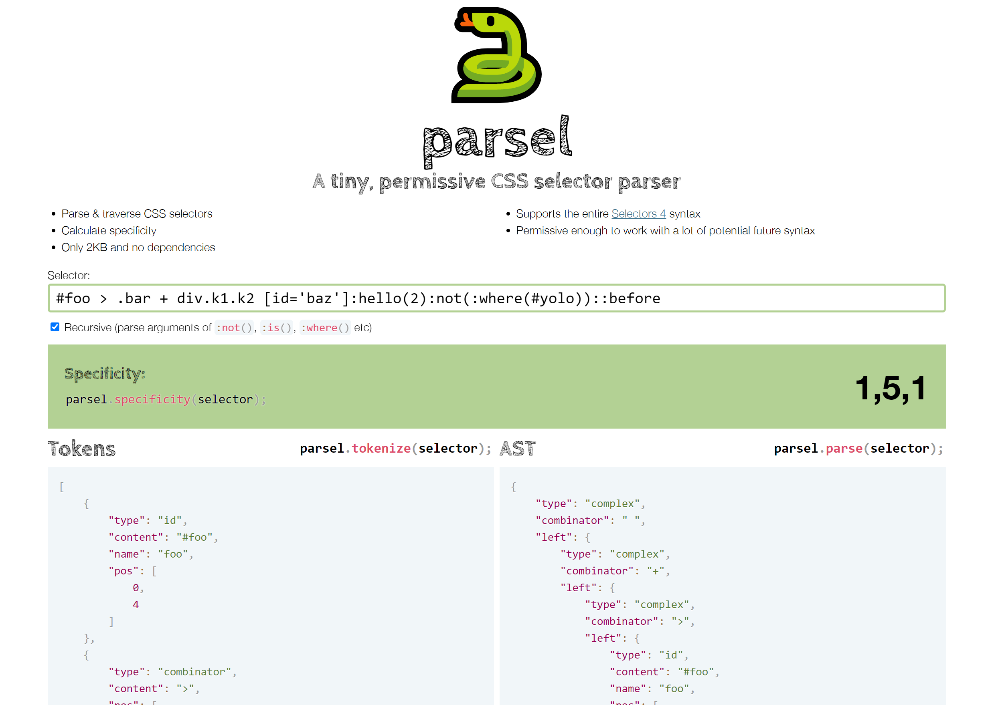

I've [posted before about my work for the Web Almanac](/tags/web-almanac/) this year. To make it easier to calculate the stats about CSS selectors, we looked to use an existing selector parser, but most were too big and/or had dependencies or didn't account for all selectors we wanted to parse, and we'd need to write our own walk and specificity methods anyway. So I did what I usually do in these cases: I wrote my own!

You can find it [here](https://projects.verou.me/parsel/): [https://projects.verou.me/parsel/](https://projects.verou.me/parsel/)

It not only parses CSS selectors, but also includes methods to walk the AST produced, as well as calculate specificity as an array and convert it to a number for easy comparison.

It is one of my first libraries released as an ES module, and there are instructions about both using it as a module, and as a global, for those who would rather not deal with ES modules yet, because convenient as ESM are, I wouldn't want to exclude those less familiar with modern JS.

Please try it out and report any bugs! We plan to use it for Almanac stats in the next few days, so if you can spot bugs sooner rather than later, you can help that volunteer effort. I'm primarily interested in **(realistic) valid selectors that are parsed incorrectly**. I'm aware there are many invalid selectors that are parsed weirdly, but that's not a focus (hence the "permissive" aspect, there are many invalid selectors it won't throw on, and that's by design to keep the code small, the logic simple, and the functionality future-proof).

### How it works

If you're just interested in using this selector parser, read no further. This section is about how the parser works, for those interested in this kind of thing. :)

I [first started by writing a typical parser, with character-by-character gobbling and different modes](https://github.com/LeaVerou/parsel/blob/master/parsel_aborted.js), with code somewhat inspired by my familiarity with [jsep](https://ericsmekens.github.io/jsep/). I quickly realized that was a more fragile approach for what I wanted to do, and would result in a much larger module. I also missed the ease and flexibility of doing things with regexes.

However, since CSS selectors include strings and parens that can be nested, parsing them with regexes is a fool's errand. _Nested structures are not [regular languages](https://en.wikipedia.org/wiki/Regular_language)_ as my CS friends know. You cannot use a regex to find the closing parenthesis that corresponds to an opening parenthesis, since you can have other nested parens inside it. And it gets even more complex when there are other tokens that can nest, such as strings or comments. What if you have an opening paren that contains a string with a closing paren, like e.g. `("foo)")`? A regex would match the closing paren inside the string. In fact, parsing the language of nested parens (strings like `(()(()))`) with regexes is one of the typical (futile) exercises in a compilers course. Students struggle to do it because it's an impossible task, and learn the hard way that not everything can be parsed with regexes.

Unlike a typical programming language with lots of nested structures however, the language of CSS selectors is more limited. There are only two nested structures: strings and parens, and they only appear in specific types of selectors (namely attribute selectors, pseudo-classes and pseudo-elements). Once we get those out of the way, everything else can be easily parsed by regexes. So I decided to go with a hybrid approach: The selector is first looked at character-by-character, to extract strings and parens. We only extract top-level parens, since anything inside them can be parsed separately (when it's a selector), or not at all. The strings are replaced by a single character, as many times as the length of the string, so that any character offsets do not change, and the strings themselves are stored in a stack. Same with parens.

After that point, this modified selector language is a regular language that can be parsed with regexes. To do so, I follow an approach inspired by the early days of [Prism](https://prismjs.com): An [object literal of tokens](https://github.com/LeaVerou/parsel/blob/master/parsel.js#L1-L10) in the order they should be matched in, and [a function that tokenizes a string by iteratively matching tokens from an object literal](https://github.com/LeaVerou/parsel/blob/master/parsel.js#L49). In fact, this function was taken from an early version of Prism and modified.

After we have the list of tokens as a flat array, we can restore strings and parens, and then nest them appropriately to create an AST.

Also note that the token regexes use the new-ish [named capture groups](https://2ality.com/2017/05/regexp-named-capture-groups.html) feature in ES2018, since it's now [supported pretty widely](https://developer.mozilla.org/en-US/docs/Web/JavaScript/Reference/Global_Objects/RegExp#Browser_compatibility) in terms of market share. For wider support, you can transpile :)
