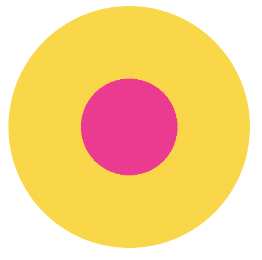
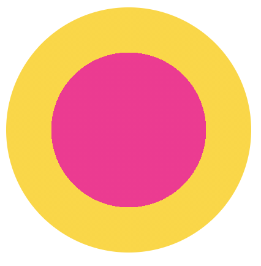

Five years ago, I had written [this extensive Smashing Magazine article](https://www.smashingmagazine.com/2015/07/designing-simple-pie-charts-with-css/) detailing multiple different methods for creating simple pie charts, either with clever use of transforms and pseudo-elements, or with SVG `stroke-dasharray`. In the end, I mentioned creating pie charts with conic gradients, as a future technique. It was actually a writeup of [my "The Missing Slice" talk](https://www.youtube.com/results?search_query=verou+missing+slice&page&utm_source=opensearch), and an excerpt of my [CSS Secrets book](http://www.amazon.com/CSS-Secrets-Lea-Verou/dp/1449372635?tag=leaverou-20), which had just been published.

I was reminded of this article today by someone on Twitter:

https://twitter.com/sam\_kent\_/status/1326805431390531584

I suggested conic gradients, since they are [now supported in >87% of users' browsers](https://caniuse.com/css-conic-gradients), but he needed to support IE11. He suggested using [my polyfill](https://projects.verou.me/conic-gradient/) from back then, but this is not a very good idea today.

https://twitter.com/fcorradini/status/1326880827825905665

Indeed, unless you _really_ need to display conic gradients, even I would not recommend using the polyfill on a production facing site. It requires [\-prefix-free](https://projects.verou.me/prefixfree/), which re-fetches (albeit from cache) your entire CSS and sticks it in a `<style>` element, with no sourcemaps since those were not a thing back when -prefix-free was written. If you're already using -prefix-free, the polyfill is great, but if not, it's way too heavy a dependency.

### Pie charts with fallback (modern browsers)

Instead, what I would recommend is graceful degradation, i.e. to use the same color stops, but in a linear gradient.

We can use `@supports` and have quite an elaborate progress bar fallback. For example, take a look at this 40% pie chart:

```
.pie {
	height: 20px;
	background: linear-gradient(to right, deeppink 40%, transparent 0);
	background-color: gold;
}

@supports (background: conic-gradient(white, black)) {
	.pie {
		width: 200px; height: 200px;
		background-image: conic-gradient(deeppink 40%, transparent 0);
		border-radius: 50%;
	}
}
```

<iframe src="https://dabblet.com/gist/9a05fd9dad59b6c0edfb99d49a7a4426" style="border: 0; width: 100%; height: 500px;"></iframe>

This is what it looks like in Firefox 82 (conic gradients are scheduled to ship unflagged in Firefox 83) or IE11:


Note that because `@supports` is only used for the pie and not the fallback, the lack of IE11 support for it doesn't affect us one iota.

If relatively modern browsers are all we care about, we could even use CSS variables for the percentage and the color stops, to avoid duplication, and to be able to set the percentage from the markup:

```html
<div class="pie" style="--p: 40%"></div>
```

```
.pie {
	height: 20px;
	--stops: deeppink var(--p, 0%), transparent 0;
	background: linear-gradient(to right, var(--stops));
	background-color: gold;
}

@supports (background: conic-gradient(white, black)) {
	.pie {
		width: 200px; height: 200px;
		background-image: conic-gradient(var(--stops));
		border-radius: 50%;
	}
}
```

You can use a similar approach for 3 or more segments, or for a vertical bar.

One issue with this approach is that our layout needs to work well with two charts of completely different proportions. To avoid that, we could just use a square:

```
.pie {
	width: 200px;
	height: 200px;
	background: linear-gradient(to right, deeppink 40%, transparent 0) gold;
}

@supports (background: conic-gradient(white, black)) {
	.pie {
		background-image: conic-gradient(deeppink 40%, transparent 0);
		border-radius: 50%;
	}
}
```

which produces this in IE11:


Granted, a square progress bar is not the same, but it can still convey the same relationship and is easier to design a layout around it since it always has the same aspect ratio.

### Why not use radial gradients?

You might be wondering, why not just use a radial gradient, which could use the same dimensions and rounding. Something like this:



There are two problems with this. The first one may be obvious: Horizontal or vertical bars are common for showing the proportional difference between two amounts, albeit less good than a pie chart because it's harder to compare with 50% at a glance (_yes Tufte, pie charts can be better for some things!_). Such circular graphs are very uncommon. And for good reason: Drawn naively (e.g. in our case if the radius of the pink circle is 40% of the radius of the yellow circle), their areas do not have the relative relationship we want to depict.

Why is that? Let _r_ be the radius of the yellow circle. As we know from middle school, the area of the entire circle is π_r_², so the area of the yellow ring is π_r_² - (area of pink circle). The area of the pink circle is π(0.4_r_)² = 0.16π_r_². Therefore, the area of the yellow ring is π_r_² - 0.16π_r_² = 0.84π_r_² and their relative ratio is 0.16π_r_² / 0.84π_r_² = 0.16 / 0.84 ≅ 0.19 which is a far cry from the 40/60 (≅ 0.67) we were looking for!

Instead, if we wanted to draw a similar visualization to depict the correct relationship, we need to start from the ratio and work our way backwards. Let _r_ be the radius of the yellow circle and _kr_ the radius of the pink circle. Their ratio is π(_kr_)² / (π_r_² - π(_kr_)²) = 4/6 ⇒
_k_² / (1 - _k_²) = 4/6 ⇒
(1 - _k_²) / _k_² = 6/4 ⇒
1/_k_² - 1 = 6/4 ⇒
1/_k_² = 10/4 ⇒
k = 2 / sqrt(10) ≅ .632
Therefore, the radius of the pink circle should be around 63.2% of the radius of the yellow circle, and a more correct chart would look like this:



In the general case where the pink circle is depicting the percentage _p_, we'd want the radius of the pink circle to be sqrt(1 / _p_) the size of the yellow circle. That's a fair bit of calculations that we can't yet automate (though [`sqrt()` is coming](https://www.w3.org/TR/css-values/#exponent-funcs)!). Moral of the story: use a bar as your fallback!
