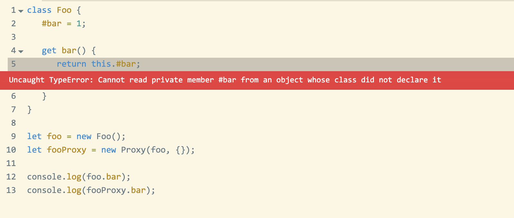

Today I mourn. What am I mourning? Encapsulation. At least in my projects.

**As a library author, I’ve decided to avoid private class fields from now on and gradually refactor them out of my existing libraries**.

Why did I make such a drastic decision?

It all started a few days ago, when I was building a [Vue 3](https://vuejs.org/) app that used [Color.js](https://colorjs.io) Color objects. For context, Vue 3 uses proxies to implement its reactivity system, just like [Mavo](https://mavo.io) did back in 2016 (the first one to do so as far as I'm aware). I was getting several errors and upon tracking them down I had a very sad realization: **instances of classes that use private fields cannot be proxied**_._

I will let that sink in for a bit. **Private fields, proxies, pick one, you can't have both.** Here is a [reduced testcase](https://codepen.io/leaverou/pen/ExdWwax?editors=0012) illustrating the problem.

<!-- more -->

Basically, because a Proxy creates a _different_ object, it breaks both strict equality (`obj1 === obj2`), as well as private properties. [MDN even has a whole section on this](https://developer.mozilla.org/en-US/docs/Web/JavaScript/Reference/Global_Objects/Proxy#no_private_property_forwarding). Unfortunately, the workaround proposed is no help when proxies are used to implement reactivity, so when [I tried to report this as a Vue bug](https://github.com/vuejs/core/issues/8149), it was (rightly) closed as wontfix. It would not be possible to fix this in [Mavo](https://mavo.io) either, for the same reason.

[I joined TC39](https://twitter.com/LeaVerou/status/1639043004190031876) fairly recently, so I was not aware of the background when proxies or private class fields were designed. Several fellow TC39 members filled me in on the discussions from back then. A lot of the background is in [this super long thread](https://github.com/tc39/proposal-class-fields/issues/106), some interesting tl;drs as replies to my tweet:

https://twitter.com/LeaVerou/status/1650562320702099457

After a lot of back and forth, I decided **I cannot justify using private properties going forwards**. The tradeoff is simply not worth it. There is no real workaround for proxy-ability, whereas for private fields there is always private-by-convention. Does it suck? Absolutely. However, **a sucky workaround is better than a nonexistent workaround**.

**Also, I control the internal implementation of my classes, whereas proxying happens by other parties.** As a library user, it must be incredibly confusing to have to deal with errors about access to private fields in a class you did not write.

This was one of the saddest PRs I have ever written [https://github.com/LeaVerou/color.js/pull/306](https://github.com/LeaVerou/color.js/pull/306). It feels like such a huge step backwards. I’ve waited years for private fields to be supported everywhere and relished when they got there. I was among the first library authors to adopt them in library code, before a lot of tooling even parsed them properly (and [some still don't](https://github.com/LeaVerou/color.js/issues/220)).

Sure, they were kind of annoying to use (you usually want protected, i.e. visible to subclasses, not actually private), but they were better than nothing. I was not joking in the first paragraph; I am literally grieving.

I may still use private fields on a case by case basis, where I cannot imagine objects being proxied being very useful, for example in web components. But from now on I will not reach to them without thought, like I have been for the past couple of years.
