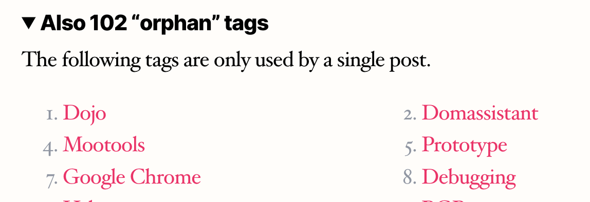

This is the third spinoff post in the [migration saga of this blog from WordPress to 11ty](../going-lean/).

Migrating was a good opportunity to [rethink the information architecture of my site](https://twitter.com/LeaVerou/status/1680900090829983744),
especially around categorization.

## Categories vs Tags

In WP, I was using both categories and tags, simply because they came for free.
However the difference between them was a bit fuzzy, as evidenced by how inconsistently they are used around the Web.
I was mainly using Categories for the *type* of article (Articles, Rants, Releases, Tips, Tutorials, News, Thoughts),
however there were also categories that were more like content tags (e.g. CSS WG, Original, Speaking, Benchmarks).

This could be easily solved by moving the latter to actual tags. However, tags were also problematic.
<!-- more -->
## Problems with tags

### Tag aliases

First, there were many tags that were **synonyms of each other**, and posts were fragmented across them, or had to include both (e.g. [JS](/blog/tags/js/) and [Javascript](/blog/tags/javascript)).
I addressed this by defining [aliases](https://github.com/LeaVerou/lea.verou.me/blob/main/data/tag_aliases.json), and using Eleventy to [dynamically build the `_redirects` file](https://github.com/LeaVerou/lea.verou.me/blob/main/redirects.njk) that Netlify reads.
I’m quite excited about this idea, as it opens up a lot of possiblities for dynamic redirects.

### Tag hierarchies?

The theory is that [categories are a taxonomy and tags a folksonomy](https://en.wikipedia.org/wiki/Folksonomy#Folksonomy_vs._taxonomy).
Taxonomies can be hierarchical, but folksonomies are flat.
However, **in practice, tags almost always have an implicit hierarchy**, which is also what [research on folksonomies in the wild tends to find](https://en.wikipedia.org/wiki/Folksonomy#Folksonomy_vs._taxonomy).

Examples from this very blog:
- There is a separate tag for [ES](/blog/tags/es/) (ECMAScript), and a separate one for [JS](/blog/tags/js).
However, any post tagged ES should also be tagged JS -- though the opposite is not true.
- There is a tag for [CSS](/blog/tags/css/), tags for specific CSS specifications (e.g. [CSS Backgrounds & Borders](/blog/tags/css-backgrounds/)), and even tags for specific CSS functions or properties (e.g. [`background-attachment`](/blog/tags/background-attachment/), [`background-size`](/blog/tags/background-size/)).
However, these are not orthogonal: posts tagged with specific CSS features should also be tagged with the CSS spec that contains them, as well as a general "CSS" tag.

**I have yet to see a use case for tagging that does *not* result in implicit hierarchies.**
Yet, all UIs for entering tags assume that they are flat.
Instead, it’s up to each individual post to maintain these relationships, which is tedious and error prone.
In practice, the more general tags are often left out, but not intentionally or predictably.

It would be much better to be able to define this hierarchy in a central place, and have it automatically applied to all posts.
In 11ty, it could be as simple as a data file for each tag’s "parent" tag.
Every time the tag is used, its parent is also added to the post automatically, recursively all the way up to the root (at build time).
I have not tried this yet, but I’m excited to experiment with it once I have a bit more time.

### Orphan tags

Lastly, another issue is what I call "orphan tags": Tags that are only used in a single post.
The primary use case for both tags and categories is to help you discover related content.
Tags that are only used once clutter the list of tags, but serve no actual purpose.
Orphan tags fall into two categories:
1. Tags that were too specific to begin with, and are unlikely to ever be used again.
2. Tags that will be used a lot in the future, but have not been used yet.

For (1), the best course of action is probably to remove the tags from the content altogether.
However for (2), there are two things to consider.

#### How to best display orphan tags in the [tag index](/blog/tags/)?

For the [tag index](/blog/tags/), I’ve separated orphan tags from the rest,
and I’m displaying them in a `
` element at the end, that is collapsed by default.

Each tag is a link to the post that uses it instead of a tags page, since there is only one post that uses it.

#### How to best display orphan tags in the post itself?

This is a little trickier.
For now, I’ve refrained from making them links, and I’m displaying them faded out to communicate this.

I’m also contemplating hiding them entirely *(since they are essentially tags that have failed at their one purpose in life)*,
or having a "and 4 orphan tags" message at the end of the list of tags, which can be clicked to show them.

Note that these combined also prevent me from having to generate tag pages for these tags,
cutting down on build time by about a second, and substantially reduced the number of pages that need to be generated.