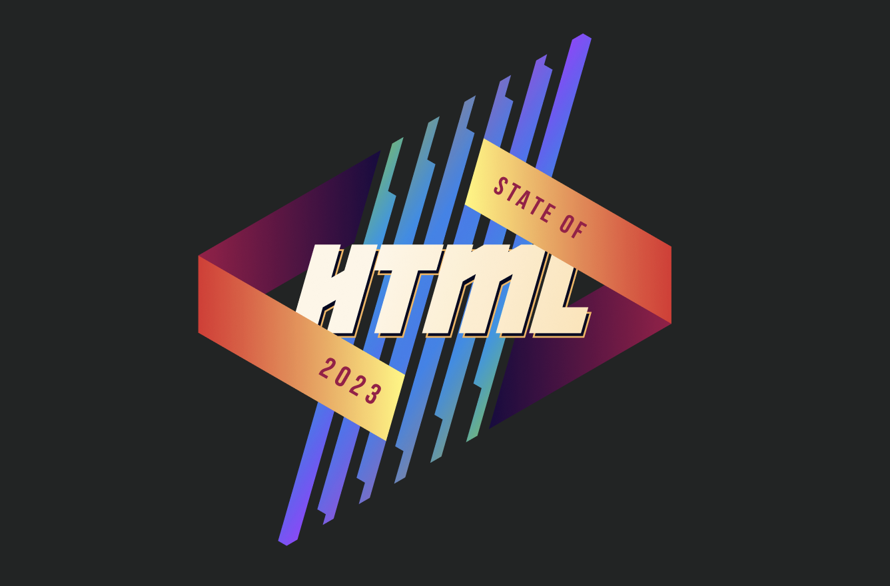
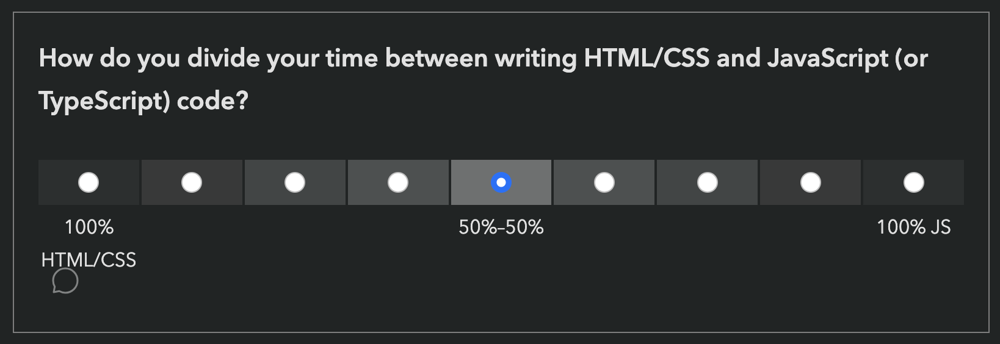
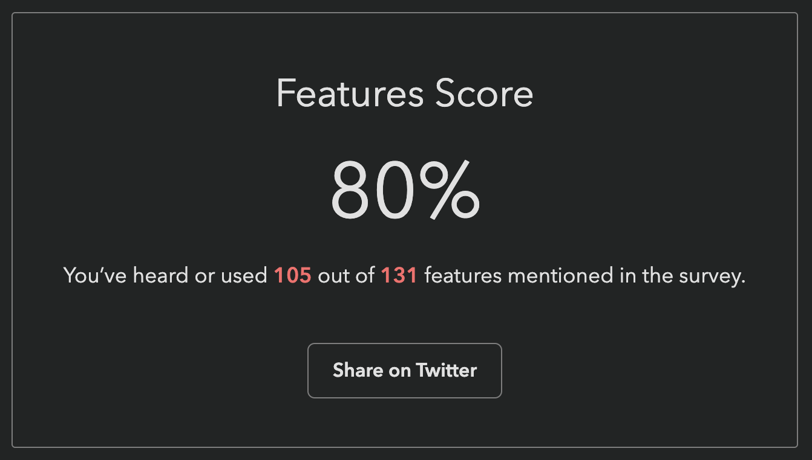
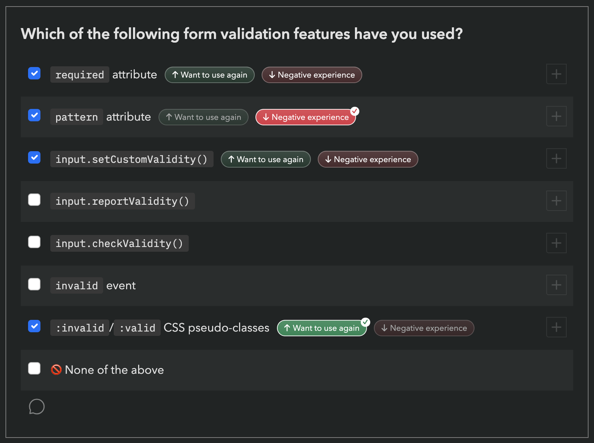

**tl;dr** the brand new State of HTML survey is finally open!

<a href="https://survey.devographics.com/en-US/survey/state-of-html/2023/?source=leaverou" class="call-to-action" target="_blank">Take State of HTML 2023 Survey</a>

Benefits to you:
- Survey results are **used by browsers to prioritize roadmaps** — the reason Google is funding this.
Time spent thoughtfully filling them out is an investment that can come back to you tenfold
in the form of seeing features you care about implemented, browser incompatibilities being prioritized, and gaps in the platform being addressed.
- Learn about new and upcoming features you may have missed
- Get a personalized score and see how you compare to other respondents
- Learn about the latest trends in the ecosystem and what other developers are focusing on

<figure>

<figcaption>

The State of HTML logo, designed by [Chris Kirk-Nielsen](https://chriskirknielsen.com/), who I think surpassed himself with this one!

</figcaption>
</figure>

## Background

This is likely the most ambitious [Devographics](https://www.devographics.com/) survey to date.
For [the past couple of months](../design-state-of-html/), I’ve been hard at work leading a small product team spread across three continents (2am to 8am became my second work shift 😅).
We embarked on this mission with some uncertainty about whether there were *enough* features for a State of HTML survey,
but quickly found ourselves with the opposite problem:
there were too many, all with good reasons for inclusion!
To help weigh the tradeoffs and decide what makes the cut we consulted both [the developer community](https://github.com/Devographics/surveys/discussions/categories/state-of-html-2023-features?discussions_q=is%3Aopen+category%3A%22State+of+HTML+2023+Features%22+sort%3Atop),
as well as stakeholders across browsers, standards groups, community groups, and more.

We even designed new UI controls to facilitate collecting the types of complex data that were needed without making the questions too taxing,
and did original UX research to validate them.
Once the dust settles, I plan to write separate blog posts about some of these.

## FAQ

### Can I edit my responses?

**Absolutely!** Do not worry about filling it out perfectly in one go.
If you create an account, you can edit your responses for the whole period the survey is open, and even split filling it out across multiple devices (e.g. start on your phone, then fill out some on your desktop, etc.)
Even if you’re filling it out anonymously, you can still edit responses on your device for a while.
You could even start anonymously and create an account later, and your responses will be preserved (the only issue is filling it out anonymously, then logging in with an existing account).

So, perhaps the call to action above should be…

<a href="https://survey.devographics.com/en-US/survey/state-of-html/2023/?source=leaverou" class="call-to-action" target="_blank"><em>Start</em> State of HTML 2023 Survey</a>

### Why are there JS questions in an HTML survey?

For the same reason there are JS APIs in the [HTML standard](https://html.spec.whatwg.org/):
many JS APIs are intrinsically related to HTML.
We mainly included JS APIs in the following areas:
- APIs used to manipulate HTML dynamically (DOM, form validation, etc.)
- Web Components APIs, used to create custom HTML elements
- APIs used to create web apps that feel like native apps (e.g. Service Workers, Web App Manifest, etc.)

If you don’t write any JS, we absolutely still want to hear from you!
In fact, I would encourage you **even more strongly** to fill out the survey: we need to hear from folks who don’t write JS, as they are often underrepresented.
Please feel free to skip any JS-related questions (all questions are optional anyway) or select that you have never heard these features.
There is a question at the end, where you can select that you only write HTML/CSS:

### Is the survey only available in English?

Absolutely not! Localization has been an integral part of these surveys since the beginning.
Fun fact: Nobody in the core [State of HTML team](#acknowledgements) is a native English speaker.

<figure>

<figcaption>

Each survey gets (at least partially) translated to over 30 languages.

</figcaption>
</figure>

However, since translations are a community effort, they are not necessarily complete, especially in the beginning.
If you are a native speaker of a language that is not yet complete, please consider [helping out](https://github.com/Devographics/locale-en-US)!

### Why is my score lower than I expected?

<figure>

<figcaption>

If it makes you feel better, this was my own score, and I *created* the darn survey 😅
Our engineer, [Sacha](https://sachagreif.com/) who is also the founder of [Devographics](https://www.devographics.com/) got 19%!

</figcaption>
</figure>

Two reasons:
1. It asks about *a lot* of cutting edge features, more than the other surveys.
As I mentioned above, we had a lot of difficult tradeoffs to make,
and had to cut a ton of features that were otherwise a great fit.
We err'ed on the side of more cutting edge features, as those are the areas the survey can help make the most difference in the ecosystem.
2. To save on space, and be able to ask about more features, we used a new compact format for some of the more stable features, which only asks about usage, not awareness.
Here is an example from the first section of the survey (Forms):

This has the downside that features you do know about but haven’t used do not count towards the final score.

We are [exploring ways to improve this experience](https://github.com/Devographics/surveys/discussions/217), such as displaying a rank among other respondents,
and/or displaying separate usage and awareness scores that combine to form the overall score.

### I found a bug, what should I do?

Please file an issue so we can fix it!

- [File content issue](https://github.com/Devographics/surveys/issues/new)
- [File technical issue](https://github.com/Devographics/Monorepo/issues/new)

## Acknowledgements

This survey would not have been possible without the hard work of many people.
Besides myself (Lea Verou), this includes the rest of the team:
- Engineering team: Sacha Greif, Eric Burel
- UX research & data science team: Shaine Rosewel Matala, Michael Quiapos, Gio Vernell Quiogue
- Our logo designer, [Chris Kirk-Nielsen](https://chriskirknielsen.com/)

And several volunteers:
- [Léonie Watson](https://tink.uk/) for accessibility feedback
- Our usability testing participants
- …and all folks who provided early feedback throuhgout the process

Last but not least, **Kadir Topal** made the survey possible in the first place, by proposing it and securing funding from Google.

Thank you all! 🙏🏼

<a href="https://survey.devographics.com/en-US/survey/state-of-html/2023/?source=leaverou" class="call-to-action" target="_blank">You still haven’t started the State of HTML 2023 survey?!</a>
